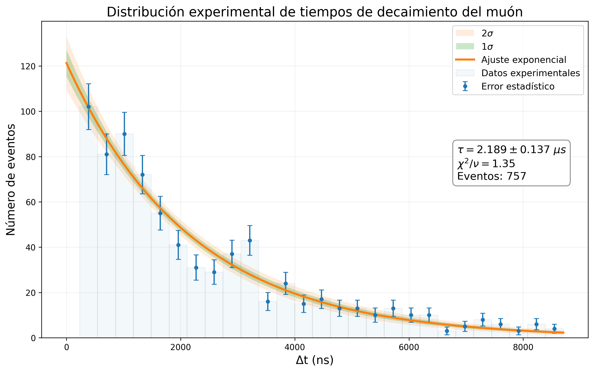

# Medición experimental de la vida media del muón

## Descripción

Proyecto de análisis de datos experimentales desarrollado para determinar la **vida media del muón** a partir de señales registradas por un sistema de adquisición de datos.

El análisis procesa automáticamente archivos experimentales en formato `.paa`, identifica eventos compatibles con el decaimiento de muones mediante la detección de pulsos y calcula la diferencia temporal entre los pulsos asociados a cada evento.

A partir de los tiempos de decaimiento obtenidos se construye una distribución experimental y se realiza un **ajuste exponencial** para estimar la vida media del muón y su incertidumbre.

## Metodología

El flujo principal del análisis consiste en:

1. Lectura de los archivos experimentales `.paa`.
2. Obtención del nivel de *threshold* y número de eventos de cada archivo.
3. Identificación automática de pulsos en cada señal.
4. Selección de eventos con dos pulsos.
5. Cálculo de la diferencia temporal \(\Delta t\) entre ambos pulsos.
6. Construcción del histograma de tiempos de decaimiento.
7. Ajuste de la distribución mediante una función exponencial.
8. Estimación de la vida media \(\tau\), su incertidumbre y el \(\chi^2\) reducido del ajuste.
9. Generación de visualizaciones y resultados del análisis.

## Modelo

La distribución temporal del decaimiento se modela mediante:

$$
N(t) = N_0 e^{-t/\tau}
$$

donde:

* \(N_0\) representa la normalización inicial.
* \(t\) es el tiempo de decaimiento.
* \(\tau\) corresponde a la vida media del muón.

Los parámetros se obtienen mediante un ajuste numérico de los datos experimentales.

## Análisis estadístico

El proyecto incluye:

* Histograma de los tiempos de decaimiento experimentales.
* Errores estadísticos asociados al número de eventos.
* Ajuste exponencial de la distribución.
* Estimación de la incertidumbre de los parámetros del ajuste.
* Propagación de incertidumbres utilizando la matriz de covarianza.
* Bandas de incertidumbre de \(1\sigma\) y \(2\sigma\).
* Cálculo del \(\chi^2\) reducido como medida de calidad del ajuste.

## Tecnologías utilizadas

* **Python**
* **NumPy** — procesamiento numérico y manipulación de señales.
* **Matplotlib** — visualización de los datos y resultados.
* **SciPy** — ajuste numérico del modelo exponencial.
* **ROOT / PyROOT** — herramientas para análisis de datos científicos.
* Procesamiento de señales experimentales.
* Ajuste de modelos y análisis estadístico.

## Estructura del repositorio

* `main.py` — procesamiento principal, detección de pulsos, análisis estadístico y generación de resultados.
* `paa01_v2.py` — lectura y manejo de los archivos experimentales `.paa`.
* `mml.ipynb` — notebook utilizado durante el desarrollo y análisis del proyecto.
* `results/` — figuras generadas a partir del análisis.
* `vida_media_muon-2.pdf` — informe del experimento y análisis realizado.

## Resultado

El análisis permite obtener experimentalmente la vida media del muón a partir de la distribución de tiempos entre los pulsos detectados y comparar los datos con el comportamiento exponencial esperado.

### Ajuste experimental

## Datos experimentales

Los archivos originales de adquisición de datos no están incluidos en el repositorio debido a su tamaño. El código está preparado para procesarlos desde el directorio local `data/`.
